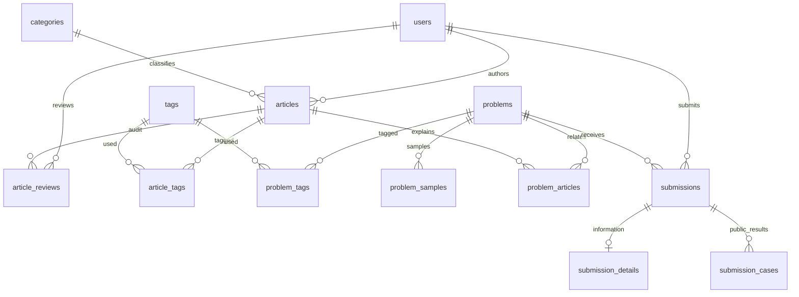

# MySQL 数据库与 Spring Boot 接入

## 现状与范围

项目为 Vue 3 / TypeScript 多页面前端、Java 21 / Spring Boot 3.5.16 后端。原后端仅有 `/api/health`；文章是 `ArticleSection[]` 静态结构，OJ 原来为浏览器本地模拟适配器，没有登录或判题服务。

新增一种访问方案：Spring JDBC + Boot 管理的 Connector/J 9.7.0 + HikariCP 6.3.3。Flyway core/mysql 同为 13.9.0：Boot 管理的 11.7.2 在实际 MySQL 8.4 上提示支持版本过旧，故单独统一升级，并进行实际重跑验证。数据库结构以 `src/main/resources/db/migration/V*.sql` 为唯一权威定义，不使用 Hibernate 自动建表。

目标要求 MySQL >= 8.0.16，执行前检查服务器实际主版本与 `DB_EXPECTED_MAJOR` 一致。MySQL 5.7 不满足本结构 CHECK 约束要求；不会升级、清空或替换电脑已有的 WAMP 数据库。本地开发应准备与 Aiven 相同主版本。所有表 InnoDB、utf8mb4、utf8mb4_unicode_ci；ASCII 公开标识采用 ascii_bin。

## 表结构

共同内部主键：有独立实体的表为有符号 BIGINT；关联外键类型相同。时间为 UTC DATETIME(6)；接口输出带 Z 的 ISO 字符串，前端显式按 Asia/Shanghai 显示。耗时统一 ms，内存统一二进制 MB（1 MB=1,048,576 字节）。

| 表 | 主要字段及类型 | 关系、约束与索引用途 |
|---|---|---|
| users | id BIGINT、public_id VARCHAR(64)、username VARCHAR(32) NULL、display_name VARCHAR(100)、password_hash VARCHAR(255) NULL、role、is_demo、disabled_at | public_id、非空 username 唯一；BCrypt 密码；仅 USER/ADMIN；历史作者和演示身份无登录用户名 |
| categories | id、name VARCHAR(64) | 分类名唯一；当前四类文章分类 |
| tags | id、name VARCHAR(64) | 名称唯一，文章与题目共用标签词典 |
| articles | id、public_id BIGINT、author_id、category_id、title VARCHAR(255)、summary TEXT、body JSON、preview JSON、featured/wide、status、data_kind、published_at | 外部数字 id 保留原文章链接；body 原样保存 ArticleSection[]（包括 code），不转换 HTML/Markdown；公开时间和分类列表索引 |
| article_tags | article_id、tag_id、position INT | 复合主键防重复；展示顺序唯一；tag_id 反向筛选索引 |
| article_reviews | id、article_id、reviewer_id、review_round INT、decision、reason TEXT、reviewed_at | 文章审核轮次唯一；外键 RESTRICT 保留审核历史；批准、驳回、直接发布、下架记录 |
| problems | id、public_id VARCHAR(32)、title、difficulty、description MEDIUMTEXT、input/output TEXT、constraints_json JSON、template_cpp17 MEDIUMTEXT、time_limit_ms、memory_limit_mb、source、status、data_kind | 题号唯一，与内部自增主键分离；status/difficulty/public_id 支持题库筛选排序；正数资源限制 |
| problem_tags | problem_id、tag_id、position | 多对多、复合主键、顺序唯一、标签反向查询索引 |
| problem_samples | id、problem_id、position、input_text/output_text MEDIUMTEXT、explanation TEXT | 每题展示顺序唯一；只存公开样例，保留原始换行 |
| problem_articles | problem_id、article_id、position | 题解关联去重，接口仅返回已公开文章 |
| submissions | id、public_id VARCHAR(64)、user_id、problem_id、language、code MEDIUMTEXT、verdict/phase、data_kind、origin、demo_session_hash、demo_scenario、submitted_at/finished_at、time_ms INT NULL、memory_mb DECIMAL(12,3) NULL | 提交编号唯一；按题目、用户、时间、结果查询的组合索引；Pending/Judging 不允许伪造耗时和完成时间；正式与演示有约束区分 |
| submission_details | submission_id PK/FK、compiler_version VARCHAR(100) NULL、information MEDIUMTEXT | 提交一对一编译／运行信息；未编译不填虚构版本 |
| submission_cases | id、submission_id、position、public_name、verdict、time_ms/memory_mb NULL | 提交一对多公开结果，顺序唯一；不含隐藏输入、答案或私有测试存储地址 |



用户、分类、标签与历史提交的外键为 RESTRICT；禁止删除仍被引用的用户／题目。日常使用 disabled_at、ARCHIVED 下架。删除文章仅级联其标签和题解关系；没有 API 开放硬删除。删除题目仅能在无提交历史时进行，级联其标签、样例、题解关系。主键不更新，所有 FK 更新规则 RESTRICT。

文章和题目标题搜索使用参数化 `LIKE '%词%'`，转义用户的 `%/_/!`，普通 B-tree 无法加速所有包含搜索。当前内容规模使用此简单方案；未增加未经验证的中文全文索引。所有排序字段白名单、LIMIT/OFFSET 由数据库执行，每页上限 100。题库及提交查询在只读事务中获得一致的 count/rows。每页标签、样例等在同一 JDBC 事务连接读取，避免小连接池嵌套借用死锁。

## 数据边界

文章导入为已有网站内容 REAL；现有 OJ 题目来源明确为 DEMO。导入不复制页面上模拟通过率、提交数或预置 AC。API 返回题目／文章时保留原字段；列表新增统一 `items/page/pages/start/end/total/size`，前端数据适配器同步接入。

提交代码是 INSERT 时的快照，更新评测步骤的 SQL 只修改 phase、verdict、指标及信息，不修改 code；没有源码修改 API。草稿继续留在浏览器，绝不更新历史快照。数据库管理员直接改表的能力不等于产品开放的源码修改功能。

真实登录、投稿审核和管理员控制台已接入，配置与使用见 `AUTH.md`。真实判题仍未实现：未登录正式提交返回 401，已登录 `POST /api/oj/submissions` 返回 501，不接受前端 AC 或耗时。正式练习 SQL 仅统计 REAL 记录，并使用 COUNT(DISTINCT problem_id)；不接受浏览器 userId。

开发演示使用独立 `/api/oj/demo/` 路径。前端可选择固定场景，后端只在 DEMO 记录中驱动 Pending→编译→Judging→完成，不能更新 REAL。请求失败不生成成功记录；NetworkError 场景不创建记录。演示身份为随机会话令牌，后端保存 SHA-256 摘要；源码仅返回同一会话的演示快照，列表不返回源码。它不是真实账号，也不是登录替代。并发推进使用事务和行锁，终态重试幂等；运行不写提交表。隐藏测试数据不进入普通接口。

个人“未尝试/失败/通过”：同一身份的已完成且非 SystemError 提交，有 AC 为通过，否则有有效结果为失败，否则未尝试。Pending、Judging、系统错误不伪装已完成练习。演示“待复盘”沿用已有 UI 的失败题目计数，不增加表或新的正式复盘业务；正式复盘功能仍预留。

## 配置与安全

配置示例 `.env.example` / `aiven.env.example` 只是模板，Spring Boot **不会自动加载 .env**。可以设置对应环境变量，或使用被 Git 忽略的 `secrets/application-private.properties`（`acm.db.*` 属性）。脚本显式传入此文件；真实凭据、CA、信任库均不入库。不要开启数据库 DEBUG 日志，不把私有配置发到聊天。

| 环境变量 | 必填／用途 |
|---|---|
| SPRING_PROFILES_ACTIVE | mysql-local 或 aiven；无 profile 时只运行原健康接口 |
| DB_HOST、DB_PORT、DB_NAME、DB_USER、DB_PASSWORD | 必填，来自实际服务配置，没有主机／数据库／root 默认值 |
| DB_EXPECTED_MAJOR | Aiven 必填，经实际版本检查填写；本地默认 8 |
| DB_TRUSTSTORE_PATH、DB_TRUSTSTORE_PASSWORD | 自定义 CA 时为 PKCS12 文件路径及私有密码；否则使用系统信任库，验证失败应导入服务 CA |
| DB_POOL_MAX | Aiven 必填，根据连接上限和实例数量分配；当前私有开发配置为 2，本地默认 4，minimumIdle=0 |
| DB_POOL_TIMEOUT_MS | 借连接超时，默认 30000；不人为延迟请求 |
| DB_POOL_MAX_LIFETIME_MS、DB_POOL_IDLE_TIMEOUT_MS、DB_POOL_KEEPALIVE_MS | 默认 120000 / 60000 / 30000；短连接寿命与心跳应对云端闲置连接被网络关闭，不增加连接数量或关闭 TLS |
| DB_ACTION | check/inspect/migrate/seed/verify/bootstrap-admin/serve，默认 serve |
| DB_ENVIRONMENT | Aiven 默认 cloud；只对明确开发库设置 development，才允许 seed/verify |
| DB_DEMO_ENABLED | 默认 false，且只有 development 允许演示写入 |
| DB_SSL_MODE | 仅本地 profile 可配置；默认 VERIFY_IDENTITY；明确 loopback 开发才允许 DISABLED，不作为云端失败后备方案 |
| PORT | API 监听端口，数据库 profile 默认 8080 |
| SERVER_ADDRESS | Aiven profile 的本地运行默认 127.0.0.1；实际部署按网关／容器配置指定监听地址 |
| VITE_DATA_SOURCE | 前端只配置 api 或离线模式；绝不放 DB_* 或密码进 VITE_* |

Aiven profile 无条件强制 `sslMode=VERIFY_IDENTITY`，同时验证 CA 链与主机名，不能用 REQUIRED/PREFERRED 替代；JDBC 密码独立传入 DataSource，不嵌入 URL。禁用 allowPublicKeyRetrieval、allowMultiQueries 和 LOAD DATA LOCAL INFILE；使用 Connector/J paranoid 模式。参考 [Aiven Java 连接说明](https://aiven.io/docs/products/mysql/howto/connect-with-java) 的服务连接信息，并按 [Connector/J 安全属性](https://dev.mysql.com/doc/connector-j/en/connector-j-connp-props-security.html) 采用更严格的身份校验。

CA 从 Aiven 服务 Overview 的 CA certificate 下载。把它放进本地 Git 忽略目录 `backend/secrets/ca.pem`，运行下面脚本导入 PKCS12；密码随机生成，仅写到本地私有配置。脚本使用 keytool 的 `-storepass:env`，不会把密码放进命令参数或输出。部署时挂载 CA 导入后的信任库，路径通过环境变量提供，不写死电脑路径，不上传任何私钥。更换服务 CA 时生成新的信任库文件后切换配置，不直接关闭验证。

```powershell
cd backend
# 使用 JDK 21；当前项目已有 .tools/jdk-21.0.12.1。
$env:JAVA_HOME = (Resolve-Path ../.tools/jdk-21.0.12.1).Path
$env:Path = "$env:JAVA_HOME\bin;$env:Path"
./scripts/Initialize-TrustStore.ps1
# Windows 打包前先停止旧后端，避免覆盖正在运行的 jar；现有信任库无需重复生成。
mvn clean package
./scripts/Database.ps1 -Profile aiven -Action check
./scripts/Database.ps1 -Profile aiven -Action migrate
# 仅明确开发库，可显式导入现有内容。生产不得运行 seed。
./scripts/Database.ps1 -Profile aiven -Action seed
./scripts/Database.ps1 -Profile aiven -Action verify
./scripts/Database.ps1 -Profile aiven -Action serve
```

本地切换用 `-Profile mysql-local` 并使用另一份私有配置：`-PrivateConfig secrets/local-private.properties`。本地数据库需要提前由有权限的人创建；云端使用 Aiven 已有数据库，不要求 CREATE DATABASE 权限。建表命令就是上述 migrate，禁止 DROP DATABASE/TRUNCATE、自动 baseline 和 Flyway clean。

首次 check 是只读操作：检查版本、已有表、Flyway history、TLS 加密及权限关键字。若非空库没有 Flyway history，migrate/serve 停止，人工分析已有结构后新增专门迁移，不自动接管或覆盖。MySQL DDL 可能隐式提交，迁移失败需分析已完成语句并制定增量修复，不删除现有表来“重试”。

迁移账号需要目标库范围的 SELECT/INSERT/UPDATE/CREATE/ALTER/INDEX/REFERENCES；后续具体迁移若有新权限会明确声明。当前迁移没有 DROP、服务器管理或创建数据库操作。权限关键字检查不等于证明作用域，应核对授予的目标库范围。运行账号需要 SELECT/INSERT/UPDATE；保存文章标签关系需要 DELETE（应用没有业务实体硬删除接口）。不用数据库管理员账号长期提供公开服务。当前初始连接使用用户提供的账号，未来部署应换成最小权限账号，配置切换不改变表模型。

生产部署：先备份和审查迁移 → 单独一个发布任务执行 check/migrate → 同版本所有服务实例启动 serve。serve 只 validate 和检查 pending，绝不自动迁移或导种子。Flyway 自身版本记录和锁提供额外保护，不能代替单一迁移发布步骤。连接预算：实例数×每实例 DB_POOL_MAX，再加迁移与管理连接，应低于服务 max_connections，并留出余量。

前端开发：本地 `.env.local` 设置 `VITE_DATA_SOURCE=api`，`npm run dev`；Vite 将 `/api` 代理到本地 Spring Boot 8080。部署时通过网关将 `/api` 转发到 Java 后端，前端绝不连接 MySQL。离线演示保留为无 `api` 开关的模式，不在 API 请求失败时偷偷切回假数据。

## 验证命令及执行记录

`mvn test` 检查参数白名单、LIKE 转义、分页、版本门槛、会话哈希、TLS 降级拒绝、前端注入评测字段拒绝；`npm run test:oj` 保留离线演示检查；`npm run build` 进行 Vue/TypeScript 和生产构建。

`DB_ACTION=verify` 只能在 development 运行：创建 UUID 前缀专用用户／内容／题目，测试中文和代码换行、多标签、多样例、提交关联、源码权限、真实／演示统计、去重、数据库筛选分页、唯一／外键／CHECK约束，整个事务最后回滚，不修改原有业务记录。AUTO_INCREMENT 序号可能增长，公开题号不依赖序号连续性。

开发内容种子由 `frontend/scripts/export-db-seed.mjs` 从现有 TS 数据导出；`node scripts/export-db-seed.mjs` 更新 JSON 快照，不执行数据库写入。显式 seed 以稳定公开标识识别记录，重复执行不新增；遇到同 ID 不同标题时回滚并报冲突，绝不覆盖。用户未来修改数据库内容不会在每次启动被种子重写。

实际连接、迁移、种子、后端重启持久化及页面验收结果另记录于 `DATABASE-VALIDATION.md`，只有实测完成的步骤才标记通过。
